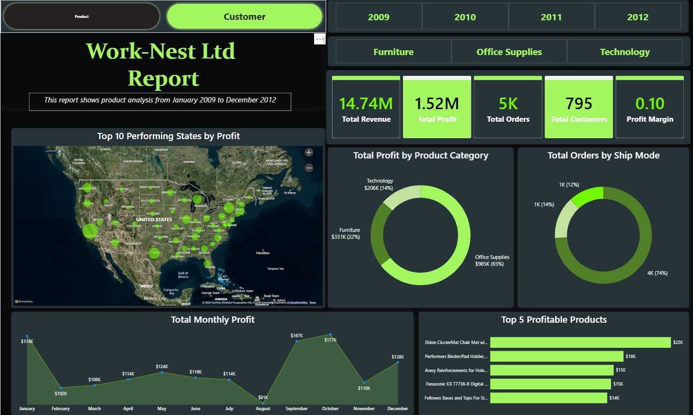
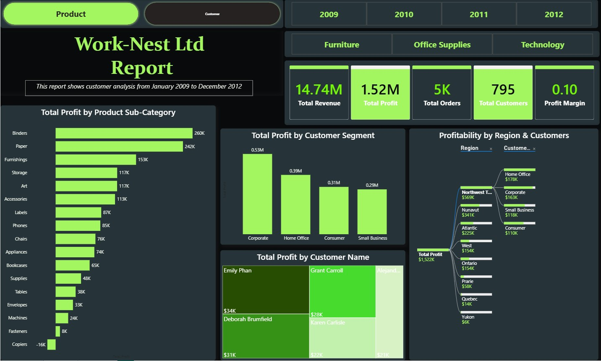
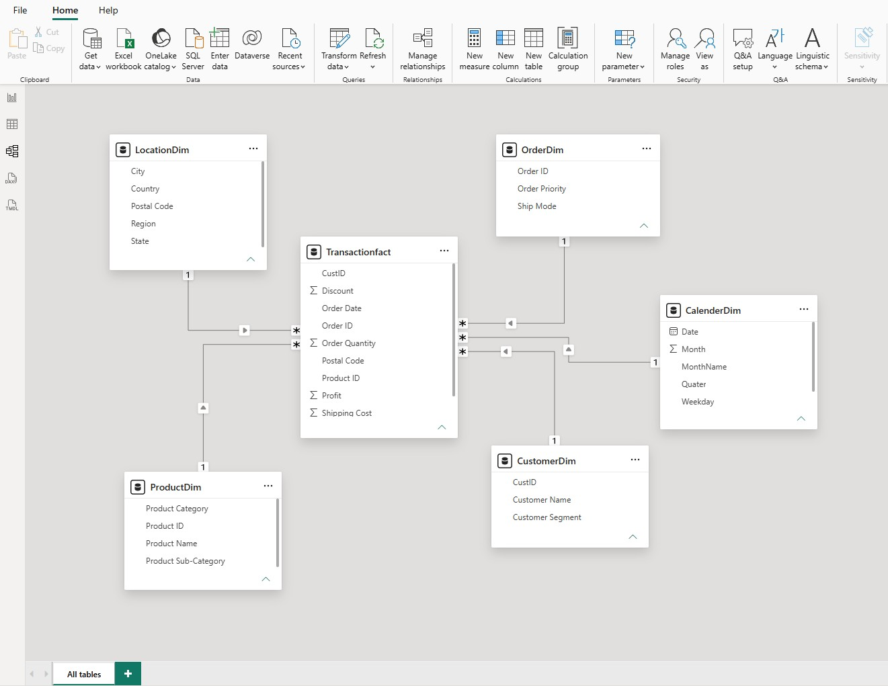

# 🛒 Work-Nest Ltd — Retail Sales & Profitability Dashboard (Power BI)

> An interactive Power BI report analysing retail sales performance across products, customers, and geographies from January 2009 to December 2012.

---

## 📌 Project Overview

This project explores four years of transactional retail data for a fictional office supplies company, Work-Nest Ltd. The goal was to build a multi-page interactive dashboard that allows stakeholders to switch between a **product performance view** and a **customer profitability view** — answering two distinct business questions from the same underlying data model.

**Business questions answered:**
- Which product categories and sub-categories are most profitable?
- Which states and regions generate the highest profit?
- How does profit trend month-to-month, and when does it dip?
- Which customer segments and individual customers drive the most revenue?
- What is the split of orders across shipping modes?

---

## 📊 Dashboard Pages

### Page 1 — Product Analysis

| Visual | Insight |
|---|---|
| KPI Cards | $14.74M total revenue · $1.52M total profit · 5K orders · 795 customers · 0.10 profit margin |
| Map — Top 10 States by Profit | Geographic profit concentration across North America |
| Donut — Profit by Category | Office Supplies 65% · Furniture 22% · Technology 14% |
| Donut — Orders by Ship Mode | Standard class dominates at 74% of all orders |
| Line — Monthly Profit Trend | Profit peaks in October–November; dips sharply in August |
| Bar — Top 5 Profitable Products | Eldon ClusterMat Chair Mat leads at $22K |

---

### Page 2 — Customer Analysis

| Visual | Insight |
|---|---|
| Bar — Profit by Sub-Category | Binders ($260K) and Paper ($242K) are the top sub-categories |
| Bar — Profit by Customer Segment | Corporate ($0.53M) outperforms Home Office, Consumer, and Small Business |
| Treemap — Profit by Customer Name | Top individual customers: Emily Phan ($34K), Deborah Brumfield ($31K) |
| Decomposition Tree — Region & Customer | Profit drilled from region → customer segment level |

---

## 🗄️ Data Model

A **star schema** was built in Power BI with one central fact table surrounded by five dimension tables:

| Table | Type | Key Fields |
|---|---|---|
| `Transactionfact` | Fact | CustID, Order ID, Product ID, Postal Code, Profit, Discount, Shipping Cost |
| `ProductDim` | Dimension | Product ID, Product Name, Category, Sub-Category |
| `CustomerDim` | Dimension | CustID, Customer Name, Customer Segment |
| `LocationDim` | Dimension | Postal Code, City, State, Region, Country |
| `OrderDim` | Dimension | Order ID, Order Priority, Ship Mode |
| `CalendarDim` | Dimension | Date, Month, MonthName, Quarter, Weekday |

---

## 🛠️ Tools & Techniques

- **Power BI Desktop** — report design, DAX measures, data modelling
- **Power Query** — data cleaning and transformation
- **DAX** — measures for Total Revenue, Total Profit, Profit Margin, Total Orders, Total Customers
- **Star schema** — relational data model with 1-to-many relationships
- **Slicers** — year (2009–2012) and product category filters applied across both pages
- **Custom theme** — dark mode with neon green accent for visual clarity

---

## 💡 Key Findings

- **Office Supplies** is the most profitable category at 65% of total profit, despite likely lower price points — driven by high order volume
- **August is a consistent low point** in monthly profit; this could indicate seasonal demand drop or discount-heavy promotions
- **Corporate customers** generate the most profit by segment ($0.53M) — nearly double Home Office ($0.39M)
- **Copiers are loss-making** at -$16K profit — suggesting deep discounting or high return rates in that sub-category
- **Standard shipping** accounts for 74% of all orders, indicating customers prioritise cost over speed

---

## 🔗 Live Dashboard

**[👉 View the interactive report on Power BI Service](https://app.powerbi.com/links/PUzks-hEBX?ctid=8f37f637-b60a-4f49-8def-81856a24889e&pbi_source=linkShare)**

> Fully interactive — use the Product / Customer toggle and year / category slicers without downloading anything.

---

## 📁 Files in This Repository

| File | Description |
|---|---|
| `worknest_dashboard_product.jpg` | Screenshot — Product page |
| `worknest_dashboard_customer.jpg` | Screenshot — Customer page |
| `worknest_data_model.jpg` | Screenshot — Star schema data model |

---

## 👤 Author

**Divine Abbah** — Data Analyst  
📧 divineabbah7@gmail.com  
🌐 [Portfolio](https://divineabbah77.netlify.app) · [LinkedIn](https://linkedin.com/in/divineabbah)
